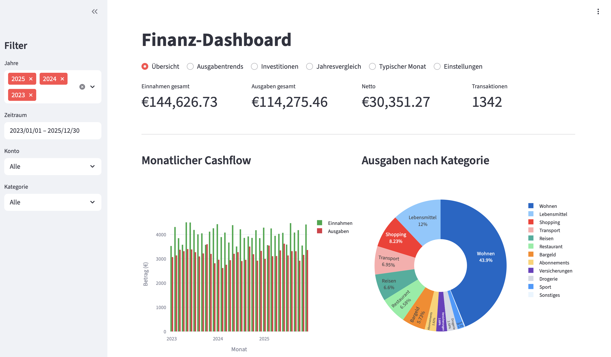

# Finance Dashboard

Personal finance dashboard for analyzing DKB (Deutsche Kreditbank) bank exports. Built with Streamlit.


[](https://github.com/smartschat/finance-dashboard/actions/workflows/test.yml)
[](https://github.com/smartschat/finance-dashboard/actions/workflows/lint.yml)


*Screenshot showing synthetic demo data*

## Table of Contents

- [Why This Tool?](#why-this-tool)
- [Features](#features)
- [Quick Start](#quick-start)
- [Categories Configuration](#categories-configuration)
- [Raspberry Pi Deployment](#raspberry-pi-deployment)
- [Development](#development)
- [Project Structure](#project-structure)
- [Exporting from DKB](#exporting-from-dkb)
- [License](#license)

## Why This Tool?

DKB provides CSV exports but no built-in analytics. This dashboard fills that gap with:

- **Privacy-first**: All data stays local, no cloud services
- **German bank format support**: Parses DKB's specific CSV format (Girokonto + Visa)
- **Customizable categories**: Define your own rules for auto-categorization
- **Self-hostable**: Run on a Raspberry Pi for 24/7 access on your home network

## Features

- **CSV Import**: Load Girokonto and Visa credit card exports from DKB
- **Auto-Categorization**: Transactions automatically categorized based on keywords and IBAN rules
- **Manual Overrides**: Recategorize individual transactions directly in the UI
- **Multiple Views**:
  - **Overview**: Key metrics, monthly cashflow, category breakdown, daily spending
  - **Spending Trends**: Track category spending over time with trend analysis
  - **Investments**: Separate view for investment transactions (buys/sells)
  - **Year Comparison**: Compare spending between years by category
  - **Typical Month**: Average monthly budget breakdown with waterfall chart
- **Transaction Clustering**: Group similar merchants (e.g., all "REWE" variations) and view transactions per cluster
- **Filtering**: By year, date range, account, and category
- **Search**: Find specific transactions instantly

## Quick Start

```bash
# Clone the repo
git clone git@github.com:smartschat/finance-dashboard.git
cd finance-dashboard

# Install dependencies
uv sync

# Add your DKB CSV exports to the project folder
# Files should match: *Girokonto*.csv and *Visa*.csv

# Run the dashboard
uv run streamlit run app.py
```

Open http://localhost:8501

On first run, `categories.json` is created automatically with empty configuration. Add your categorization rules via the Settings tab in the UI.

## Categories Configuration

Transaction categorization is configured via `categories.json` (gitignored as it contains personal data):

```json
{
  "rules": {
    "Groceries": ["rewe", "edeka", "aldi", "lidl"],
    "Transport": ["db bahn", "uber", "tier"]
  },
  "iban_rules": {
    "DE89370400440532013000": "Rent",
    "DE12345678901234567890": "Salary"
  },
  "overrides": {
    "2024-01-15_-50.00_abc123": "Shopping"
  },
  "clusters": {
    "Amazon": ["amzn", "amazon"]
  },
  "config": {
    "non_spend_categories": ["Umbuchungen", "Kreditkarte", "Investitionen"],
    "cc_settlement_patterns": ["kreditkartenabrechnung"]
  }
}
```

| Key | Description |
|-----|-------------|
| `rules` | Map category names to keyword patterns (matched against description) |
| `iban_rules` | Map specific IBANs to categories (e.g., landlord IBAN → "Rent") |
| `overrides` | Manual category assignments for specific transactions |
| `clusters` | Group similar merchant names for cleaner reporting |
| `config` | Non-spending categories excluded from totals, credit card settlement patterns |

### Special Categories

Some category names have special functionality:

| Category | Behavior |
|----------|----------|
| `Investitionen` | Dedicated **Investments** tab with buy/sell tracking and cumulative charts |
| `Abonnements` | Subscription analysis table in **Overview** tab |
| `Kreditkarte` | Auto-assigned to credit card settlements (detected via `cc_settlement_patterns`) |
| `Sonstiges` | Default category for transactions matching no rules |
| `Umbuchungen` | Internal transfers (default excluded from spending calculations) |
| `Gehalt` | Salary — no special behavior, but suggested in IBAN rules dropdown |

To use the Investments or Subscriptions features, create categories with these exact names (German spelling).

## Raspberry Pi Deployment

Host the dashboard on a Raspberry Pi for 24/7 access from any device on your network.

### Quick Setup

```bash
# On the Pi: Install uv and clone
curl -LsSf https://astral.sh/uv/install.sh | sh
source ~/.local/bin/env
git clone git@github.com:smartschat/finance-dashboard.git
cd finance-dashboard
uv sync

# From your Mac/PC: Copy data files
scp *.csv categories.json pi@<pi-ip>:~/finance-dashboard/

# On the Pi: Run the dashboard
uv run streamlit run app.py --server.address 0.0.0.0
```

Access at `http://<pi-ip>:8501`

### Advanced Setup

For a production setup with systemd service, Pi-hole DNS (`http://finance.home`), and nginx reverse proxy, see **[PI_SETUP.md](PI_SETUP.md)** for the full guide.

Use `sync-to-pi.sh` to sync data and restart the service:

```bash
./sync-to-pi.sh pi@<pi-ip>
```

## Development

```bash
# Run tests
uv run pytest

# Run tests with coverage
uv run pytest --cov=finance_dashboard

# Lint and format
uv run ruff check
uv run ruff format

# Install pre-commit hooks
uv run pre-commit install
```

## Project Structure

```
finance-dashboard/
├── app.py                 # Main Streamlit dashboard
├── finance_dashboard/     # Core library modules
│   ├── config.py          # Configuration loading
│   ├── data/              # CSV parsing and loading
│   └── categorization/    # Rules, overrides, clustering
├── tests/                 # pytest tests
├── categories.json        # Category rules (gitignored)
├── *.csv                  # DKB export files (gitignored)
├── PI_SETUP.md            # Detailed Raspberry Pi setup guide
├── nginx.conf             # nginx reverse proxy config
├── sync-to-pi.sh          # Script to sync data to Pi
└── pyproject.toml         # Project dependencies
```

## Exporting from DKB

1. Log into DKB online banking
2. Go to your account → Umsätze (transactions)
3. Set date range and click "Exportieren" → CSV
4. Repeat for each account (Girokonto, Visa)
5. Place CSV files in the project folder

## License

MIT
